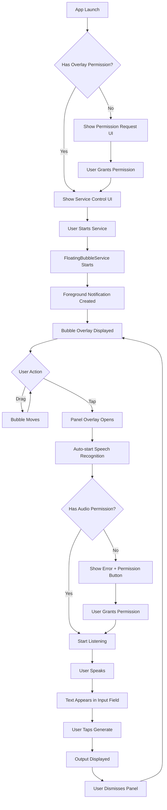

# FloatNote Architecture Documentation

## 📋 Table of Contents
1. [Overview](#overview)
2. [Architecture Diagram](#architecture-diagram)
3. [Core Components](#core-components)
4. [Application Flow](#application-flow)
5. [Permission System](#permission-system)
6. [Speech Recognition Integration](#speech-recognition-integration)
7. [Service Lifecycle](#service-lifecycle)
8. [UI Components](#ui-components)
9. [Key Design Decisions](#key-design-decisions)
10. [Technical Challenges & Solutions](#technical-challenges--solutions)

---

## Overview

**FloatNote** is an Android application that provides a floating bubble overlay for quick note-taking with speech-to-text capabilities. The app allows users to create notes from anywhere on their device using a persistent floating bubble that can be accessed over other apps.

### Key Features
- 🎈 **Floating Bubble Overlay** - Draggable bubble accessible from any screen
- 🎤 **Speech Recognition** - Voice-to-text input for hands-free note creation
- 📝 **Text Input** - Manual text entry option
- 🔒 **Permission Management** - Handles overlay and microphone permissions
- ⚡ **Foreground Service** - Ensures bubble remains active

### Technology Stack
- **Language:** Kotlin
- **UI Framework:** Jetpack Compose
- **Minimum SDK:** 21 (Android 5.0)
- **Target SDK:** 36 (Android 15+)
- **Architecture:** Service-based with Compose UI

---

## Architecture Diagram

```
┌─────────────────────────────────────────────────────────────┐
│                         FloatNote App                        │
├─────────────────────────────────────────────────────────────┤
│                                                              │
│  ┌──────────────────┐         ┌─────────────────────────┐  │
│  │   MainActivity   │────────▶│  FloatingBubbleService  │  │
│  │                  │ starts  │   (Foreground Service)  │  │
│  │  - Permissions   │         │                         │  │
│  │  - Service Ctrl  │         │  ┌──────────────────┐   │  │
│  └──────────────────┘         │  │  BubbleOverlay   │   │  │
│           │                   │  │  (Draggable UI)  │   │  │
│           │                   │  └──────────────────┘   │  │
│           │                   │           │             │  │
│           │                   │           ▼             │  │
│           │                   │  ┌──────────────────┐   │  │
│           │                   │  │  OverlayPanel    │   │  │
│           │                   │  │  (Input UI)      │   │  │
│           │                   │  └──────────────────┘   │  │
│           │                   │           │             │  │
│           │                   │           ▼             │  │
│           │                   │  ┌──────────────────┐   │  │
│           │                   │  │ SpeechRecognizer │   │  │
│           │                   │  └──────────────────┘   │  │
│           │                   └─────────────────────────┘  │
│           │                                                │
│           ▼                                                │
│  ┌──────────────────┐                                     │
│  │  Android System  │                                     │
│  │  - Permissions   │                                     │
│  │  - WindowManager │                                     │
│  │  - Notifications │                                     │
│  └──────────────────┘                                     │
│                                                              │
└─────────────────────────────────────────────────────────────┘
```

---

## Core Components

### 1. MainActivity
**Location:** [`MainActivity.kt`](app/src/main/java/dev/cazimir/floatnote/MainActivity.kt)

**Responsibilities:**
- Entry point for the application
- Permission request handling (overlay & audio)
- Service lifecycle management (start/stop)
- User interface for service control

**Key Features:**
- Uses `ActivityResultContracts` for permission requests
- Monitors permission states with `mutableStateOf`
- Provides UI to grant permissions and control service
- Handles intent extras for permission requests from service

**State Management:**
```kotlin
- hasOverlayPermission: Boolean  // SYSTEM_ALERT_WINDOW permission
- hasAudioPermission: Boolean    // RECORD_AUDIO permission
- isServiceRunning: Boolean      // Service state tracking
```

---

### 2. FloatingBubbleService
**Location:** [`FloatingBubbleService.kt`](app/src/main/java/dev/cazimir/floatnote/service/FloatingBubbleService.kt)

**Responsibilities:**
- Manages the floating bubble overlay
- Handles speech recognition
- Maintains foreground service for persistent operation
- Manages Compose lifecycle within a Service context

**Key Features:**
- Implements `LifecycleOwner`, `SavedStateRegistryOwner`, `ViewModelStoreOwner`
- Creates and manages WindowManager overlays
- Integrates Android SpeechRecognizer API
- Handles foreground service notifications

**Important Implementation Details:**

#### Lifecycle Management
The service implements multiple lifecycle interfaces to support Jetpack Compose:
```kotlin
class FloatingBubbleService : Service(), 
    LifecycleOwner, 
    SavedStateRegistryOwner, 
    ViewModelStoreOwner
```

This is necessary because Compose requires these components, but Service doesn't provide them by default.

#### Foreground Service Type
```kotlin
android:foregroundServiceType="specialUse"
```
Uses `specialUse` type (not `microphone`) to avoid permission requirements at service start. The microphone permission is only checked when speech recognition is actually used.

#### Overlay Management
Creates two separate overlays:
1. **Bubble Overlay** - Small draggable circle (always visible)
2. **Panel Overlay** - Larger input panel (shown on bubble tap)

---

### 3. BubbleOverlay (Composable)
**Location:** [`BubbleOverlay.kt`](app/src/main/java/dev/cazimir/floatnote/ui/BubbleOverlay.kt)

**Responsibilities:**
- Renders the floating bubble UI
- Handles drag gestures
- Detects tap events

**Key Features:**
- 60dp circular button with "FN" text
- Drag detection with `detectDragGestures`
- Prevents tap events during drag operations
- Material 3 theming support

**Gesture Handling:**
```kotlin
- onDrag: (Float, Float) -> Unit  // Reports drag deltas to service
- onTap: () -> Unit               // Opens the overlay panel
```

---

### 4. OverlayPanel (Composable)
**Location:** [`OverlayPanel.kt`](app/src/main/java/dev/cazimir/floatnote/ui/OverlayPanel.kt)

**Responsibilities:**
- Provides note input interface
- Controls speech recognition
- Displays recognition status and errors
- Shows generated output

**Key Features:**
- Speech recognition controls (start/stop)
- Text input field with 3-5 line display
- Error message display with permission prompts
- Listening indicator with progress animation
- Generate button (currently shows example output)

**State Parameters:**
```kotlin
- inputText: String              // Current input text
- isListening: Boolean           // Speech recognition state
- errorMessage: String           // Error display
- outputText: String (internal)  // Generated output
```

---

## Application Flow

### User Journey Flow



---

## Permission System

### Required Permissions

#### 1. SYSTEM_ALERT_WINDOW (Overlay Permission)
**Purpose:** Allows the app to draw over other apps

**Request Flow:**
```kotlin
MainActivity.requestOverlayPermission()
    ↓
Settings.ACTION_MANAGE_OVERLAY_PERMISSION
    ↓
User grants in system settings
    ↓
MainActivity.onResume() checks permission
    ↓
Service can be started
```

**Check Method:**
```kotlin
Settings.canDrawOverlays(context)  // API 23+
```

#### 2. RECORD_AUDIO (Microphone Permission)
**Purpose:** Required for speech recognition

**Request Flow:**
```kotlin
User taps bubble → Panel opens → Auto-starts listening
    ↓
Permission check fails
    ↓
Error message shown with "Grant Permission" button
    ↓
Opens MainActivity with REQUEST_AUDIO_PERMISSION extra
    ↓
Runtime permission request
    ↓
User grants permission
    ↓
Speech recognition works
```

**Check Method:**
```kotlin
ContextCompat.checkSelfPermission(context, RECORD_AUDIO)
```

#### 3. POST_NOTIFICATIONS (Android 13+)
**Purpose:** Required to show foreground service notification

**Behavior:**
- Automatically requested by system when notification is posted
- Required for foreground service on Android 13+

#### 4. FOREGROUND_SERVICE & FOREGROUND_SERVICE_SPECIAL_USE
**Purpose:** Allows the app to run a foreground service

**Type:** `specialUse`
- Used for the floating overlay functionality
- Requires explanation in manifest property
- Does NOT require microphone permission at service start

---

## Speech Recognition Integration

### Architecture

```
FloatingBubbleService
    │
    ├─ SpeechRecognizer instance
    │   └─ RecognitionListener callbacks
    │
    ├─ State Management
    │   ├─ isListening: Boolean
    │   ├─ inputText: String
    │   └─ errorMessage: String
    │
    └─ UI Updates (via Compose state)
```

### Recognition Flow

1. **Initialization**
   ```kotlin
   speechRecognizer = SpeechRecognizer.createSpeechRecognizer(context)
   speechRecognizer.setRecognitionListener(recognitionListener)
   ```

2. **Start Listening**
   - Check `RECORD_AUDIO` permission
   - Check if recognition is available
   - Create recognition intent with `LANGUAGE_MODEL_FREE_FORM`
   - Enable partial results
   - Start listening

3. **Recognition Callbacks**
   - `onReadyForSpeech()` - Ready to listen
   - `onBeginningOfSpeech()` - User started speaking
   - `onPartialResults()` - Interim results (not currently used)
   - `onResults()` - Final recognized text
   - `onError()` - Detailed error handling
   - `onEndOfSpeech()` - User stopped speaking

4. **Text Handling**
   ```kotlin
   // Appends recognized text to existing input
   inputText = if (inputText.isEmpty() || inputText.endsWith(" ")) {
       "$inputText$recognizedText"
   } else {
       "$inputText $recognizedText"
   }
   ```

### Error Handling

Comprehensive error messages for all recognition errors:
- `ERROR_AUDIO` - Microphone issues
- `ERROR_INSUFFICIENT_PERMISSIONS` - Permission denied
- `ERROR_NETWORK` - Network connectivity issues
- `ERROR_NO_MATCH` - No speech detected
- `ERROR_RECOGNIZER_BUSY` - Recognizer in use
- `ERROR_SERVER` - Server-side errors
- `ERROR_SPEECH_TIMEOUT` - No input detected

---

## Service Lifecycle

### Service States

```
NOT_CREATED
    ↓
onCreate() → CREATED
    ├─ Create notification channel
    ├─ Start foreground with notification
    ├─ Create bubble overlay
    └─ Set lifecycle state to STARTED
    ↓
onStartCommand() → RUNNING
    ↓
User interacts with bubble
    ↓
onDestroy() → DESTROYED
    ├─ Stop speech recognition
    ├─ Destroy speech recognizer
    ├─ Remove bubble overlay
    ├─ Remove panel overlay
    └─ Set lifecycle state to DESTROYED
```

### Compose in Service Challenge

**Problem:** Jetpack Compose requires `LifecycleOwner`, `ViewModelStoreOwner`, and `SavedStateRegistryOwner`, but `Service` doesn't implement these.

**Solution:** Manual implementation
```kotlin
class FloatingBubbleService : Service(), 
    LifecycleOwner, 
    SavedStateRegistryOwner, 
    ViewModelStoreOwner {
    
    private val lifecycleRegistry = LifecycleRegistry(this)
    private val savedStateRegistryController = SavedStateRegistryController.create(this)
    private val _viewModelStore = ViewModelStore()
    
    // Implement required properties and setup ComposeView
}
```

### Recomposer Setup

Each `ComposeView` needs a `Recomposer`:
```kotlin
private fun setupComposeView(composeView: ComposeView) {
    composeView.setViewTreeLifecycleOwner(this)
    composeView.setViewTreeViewModelStoreOwner(this)
    composeView.setViewTreeSavedStateRegistryOwner(this)
    
    val coroutineContext = AndroidUiDispatcher.CurrentThread
    val runRecomposeScope = CoroutineScope(coroutineContext)
    val recomposer = Recomposer(coroutineContext)
    composeView.compositionContext = recomposer
    
    runRecomposeScope.launch {
        recomposer.runRecomposeAndApplyChanges()
    }
}
```

---

## UI Components

### Theme System
**Location:** `app/src/main/java/dev/cazimir/floatnote/ui/theme/`

- [`Color.kt`](app/src/main/java/dev/cazimir/floatnote/ui/theme/Color.kt) - Material 3 color scheme
- [`Theme.kt`](app/src/main/java/dev/cazimir/floatnote/ui/theme/Theme.kt) - Theme configuration with dynamic colors
- [`Type.kt`](app/src/main/java/dev/cazimir/floatnote/ui/theme/Type.kt) - Typography definitions

### Overlay Window Parameters

#### Bubble Overlay
```kotlin
WindowManager.LayoutParams(
    width = WRAP_CONTENT,
    height = WRAP_CONTENT,
    type = TYPE_APPLICATION_OVERLAY,  // API 26+
    flags = FLAG_NOT_FOCUSABLE,       // Doesn't steal focus
    format = PixelFormat.TRANSLUCENT
)
```

#### Panel Overlay
```kotlin
WindowManager.LayoutParams(
    width = WRAP_CONTENT,
    height = WRAP_CONTENT,
    type = TYPE_APPLICATION_OVERLAY,
    flags = FLAG_NOT_TOUCH_MODAL |    // Allows outside touches
            FLAG_WATCH_OUTSIDE_TOUCH, // Detects outside touches
    format = PixelFormat.TRANSLUCENT
)
```

### Drag Handling

Bubble position updates:
```kotlin
onDrag = { dx, dy ->
    bubbleParams?.let { params ->
        params.x += dx.toInt()  // Update X position
        params.y += dy.toInt()  // Update Y position
        windowManager.updateViewLayout(bubbleView, params)
    }
}
```

---

## Key Design Decisions

### 1. **Service-Based Architecture**
**Decision:** Use a foreground service instead of an activity-based overlay

**Rationale:**
- Persists across app navigation
- Survives app process death (with START_STICKY)
- Can run independently of MainActivity
- Provides user-visible notification (required for foreground services)

### 2. **Foreground Service Type: specialUse**
**Decision:** Use `specialUse` instead of `microphone` type

**Rationale:**
- Avoids requiring microphone permission at service start
- Microphone is only used on-demand (when user activates speech recognition)
- Prevents Android 14+ crash when permission not granted
- More accurate representation of service purpose (overlay, not continuous recording)

### 3. **Auto-Start Speech Recognition**
**Decision:** Automatically start listening when panel opens

**Rationale:**
- Reduces user friction (one less tap)
- Aligns with voice-first interaction model
- User can still manually type if preferred
- Gracefully handles permission denial

### 4. **Two-Overlay System**
**Decision:** Separate bubble and panel overlays instead of single expandable view

**Rationale:**
- Better performance (panel only created when needed)
- Easier window management
- Clearer separation of concerns
- Panel can be dismissed without affecting bubble

### 5. **Compose in Service**
**Decision:** Use Jetpack Compose for UI instead of XML views

**Rationale:**
- Modern, declarative UI
- Easier state management
- Better theming support
- Consistent with modern Android development
- Requires manual lifecycle setup (acceptable trade-off)

### 6. **State Management**
**Decision:** Use Compose `mutableStateOf` for UI state

**Rationale:**
- Automatic UI updates on state changes
- No manual view updates needed
- Type-safe state handling
- Integrates well with Compose

---

## Technical Challenges & Solutions

### Challenge 1: Compose Lifecycle in Service
**Problem:** Service doesn't implement lifecycle interfaces required by Compose

**Solution:** 
- Manually implement `LifecycleOwner`, `ViewModelStoreOwner`, `SavedStateRegistryOwner`
- Create and manage lifecycle registry
- Set up Recomposer for each ComposeView
- Properly transition lifecycle states in service callbacks

### Challenge 2: Android 14+ Foreground Service Restrictions
**Problem:** Declaring `microphone` type requires permission at service start

**Solution:**
- Changed to `specialUse` type
- Check microphone permission only when speech recognition is used
- Provide clear error messages and permission request flow
- Removed `FOREGROUND_SERVICE_MICROPHONE` permission from manifest

### Challenge 3: Drag vs Tap Detection
**Problem:** Tap events firing after drag operations

**Solution:**
- Track `isDragging` state
- Set to `true` during drag
- Only trigger tap if `!isDragging`
- Reset state on drag end

### Challenge 4: Permission Request from Service
**Problem:** Service can't request runtime permissions directly

**Solution:**
- Service opens MainActivity with intent extra
- MainActivity handles permission request
- User returns to service overlay after granting
- Service checks permission before using feature

### Challenge 5: Speech Recognition State Management
**Problem:** Coordinating recognition state with UI updates

**Solution:**
- Use Compose state variables (`isListening`, `inputText`, `errorMessage`)
- State changes automatically trigger UI recomposition
- Recognition callbacks update state
- UI reflects current recognition status

### Challenge 6: Text Accumulation
**Problem:** Appending multiple speech recognition results

**Solution:**
```kotlin
inputText = if (inputText.isEmpty() || inputText.endsWith(" ")) {
    "$inputText$recognizedText"
} else {
    "$inputText $recognizedText"  // Add space separator
}
```

---

## Future Considerations

### Potential Enhancements
1. **Note Persistence** - Save notes to database or file system
2. **AI Integration** - Actual note generation/formatting (currently shows example)
3. **Multiple Bubble Positions** - Remember last position
4. **Customization** - Bubble color, size, position presets
5. **Note Categories** - Organize notes by type
6. **Export Options** - Share or export notes
7. **Voice Commands** - "Save note", "Clear", etc.
8. **Continuous Listening** - Keep listening after each result
9. **Language Selection** - Support multiple languages

### Technical Debt
1. **Service State Persistence** - Service doesn't remember if it was running after app restart
2. **Output Generation** - Currently shows hardcoded example text
3. **Partial Results** - Not currently displayed to user
4. **Bubble Position** - Resets to (100, 100) on service restart
5. **Testing** - No unit or integration tests

---

## Resources

### Android Documentation
- [Foreground Services](https://developer.android.com/develop/background-work/services/foreground-services)
- [Speech Recognition](https://developer.android.com/reference/android/speech/SpeechRecognizer)
- [WindowManager](https://developer.android.com/reference/android/view/WindowManager)
- [Jetpack Compose](https://developer.android.com/jetpack/compose)

### Related Files
- [`AndroidManifest.xml`](app/src/main/AndroidManifest.xml) - Permissions and service declaration
- [`build.gradle.kts`](app/build.gradle.kts) - Dependencies and SDK configuration
- [`strings.xml`](app/src/main/res/values/strings.xml) - UI text resources

---

**Last Updated:** 2025-11-28  
**Version:** 1.0  
**Target SDK:** 36 (Android 15+)
